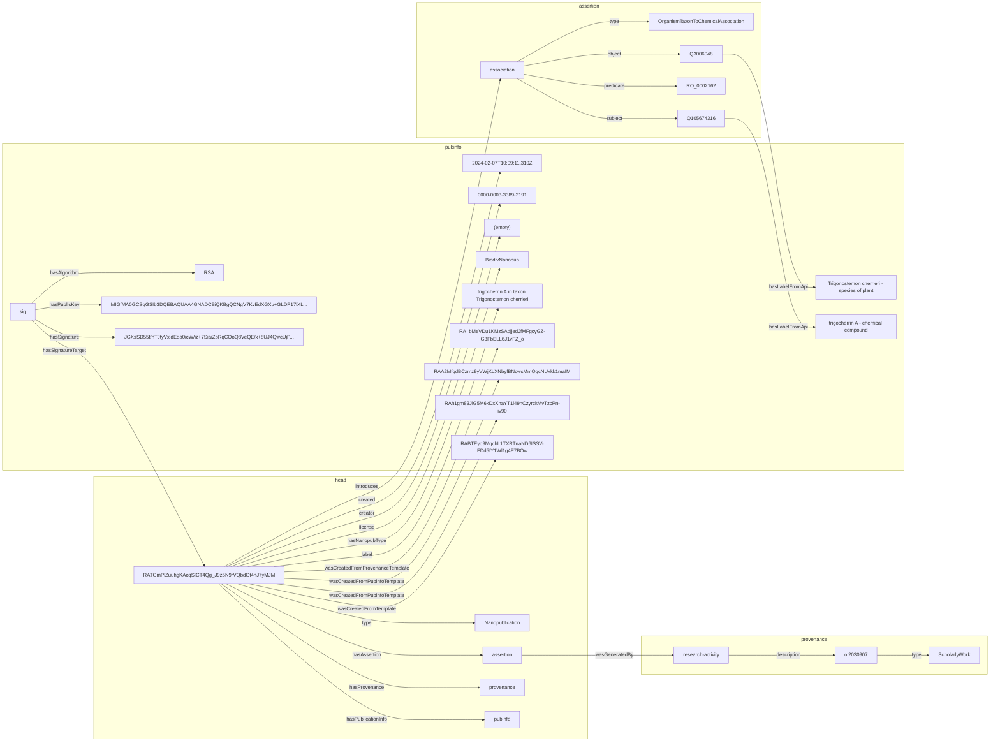

nanopub-pg
===========

Small CLI to play with the nanopub-rs library: fetch and check Nanopublications from a URI or a local TriG/TriX file.

Usage
-----

- Build and run with a sample URI:
  - `cargo run`

- Check one or more Nanopubs by URI:
  - `cargo run -- https://w3id.org/np/RAltRkGOtHoj5LcBJZ62AMVOAVc0hnxt45LMaCXgxJ4fw https://w3id.org/np/RA...`

- Check a local file (TriG/TriX) containing a single Nanopublication:
  - `cargo run -- ./path/to/np.trig`

- Output a Mermaid graph of the Nanopub (to stdout or files):
  - `cargo run -- --mermaid https://w3id.org/np/RAltRkGOtHoj5LcBJZ62AMVOAVc0hnxt45LMaCXgxJ4fw > np.mmd`
  - For multiple inputs, files `np_0.mmd`, `np_1.mmd`, … are created.
  - View with VS Code Mermaid preview or render via `mmdc` (Mermaid CLI).

Example
-------

Mermaid example (trimmed) showing ~~colored~~ subgraphs for Head, Assertion, Provenance and PubInfo. Nodes are colored per subgraph for readability.

What it does
------------

- For URIs: asynchronously fetches the Nanopub via `Nanopub::fetch`, then validates it with `check()`.
- For files: loads the RDF into `Nanopub::new`, then validates with `check()`.
- Prints a concise `NpInfo` summary and the RDF size.

References
----------

- Docs: https://vemonet.github.io/nanopub-rs/packages/#check-nanopubs
- Crate: https://crates.io/crates/nanopub

Project Structure
-----------------

- `src/main.rs` — thin entry point wiring modules together.
- `src/args.rs` — minimal CLI parsing (`--mermaid`, inputs).
- `src/app.rs` — app orchestration: runtime, per-input processing, calling render/validate.
- `src/loader.rs` — load a `Nanopub` from URI (async fetch) or local file.
- `src/renderer.rs` — Mermaid graph rendering (grouped subgraphs and colors).

Contributing
------------

- Keep modules focused (I/O, rendering, orchestration).
- Avoid printing in library-like modules (renderer/loader), return strings/results instead. The app layer decides what to print.
- Prefer small functions with clear inputs/outputs; no global state.
